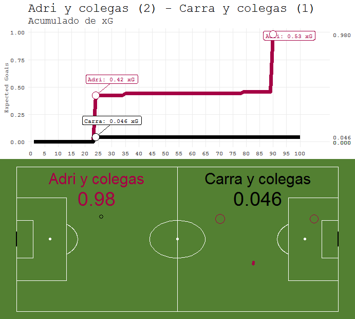
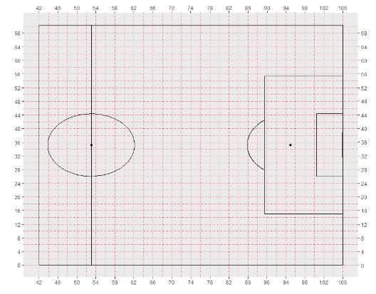

MapxGgraphR
================
Jesús Lagos @Vdot\_spain <jelagmil@gmail.com>
2019-11-21

<!-- README.md is generated from README.Rmd. Please edit that file -->
La libreria MapxGgraphR está pensada para poder hacer visualizaciones de mapas de disparos y agregados de xG a partir de datos de entrada de disparos con los que se calcula el xG del disparo con un modelo propio.

Versiones
=========

Versión 0.1

Instalación y Ayuda
-------------------

Para instalar el paquete desde Github:

``` r
devtools::install_github('jelagmil/MapxGgraphR', build_opts = c("--no-resave-data", "--no-manual"))
library(MapxGgraphR)
```

Una vez instalado puedes leer la explicación de la libreria ejecutando:

``` r
#Para que se abra en el navegador:
browseVignettes("MapxGgraphR")

#Para que se abra en la pestaña de Help de RStudio:
vignette("MapxGgraphR")
```

Para conocer cada función y como se usa cada una también puedes usar "?" seguido de la función para mostrar la ayuda en la pestaña de Help de RStudio. Si apretas F1 con el cursor puesto en la función también se despliega en la ayuda:

``` r
?xGgraph
```

xGgraph
-------

Con esta función `xGgraph()` creamos el mapa con los datos de los tiros de dos equipos, calculando para cada disparo el xG y calculando el resultado a partir de los xG. La función en la consola te va pidiendo los datos para construir el campo con los tiros.

``` r
#Si la invocamos direcamente nos saldrá en consola como introducir los datos (Ver tutorial más abajo):
xGgraph()
```

quedaría:



TUTORIAL
---------------

-  Lo primero que tendrás que hacer es apuntar en un partido todos los disparos que hay mientras lo ves. Por desgracia el partido de Solteros - Casados de la peña o la falla aún no se suministra por OPTA, pero apuntanto algunos datos podrás construirlo.
- Los datos necesarios son:

1. Coordenada del disparo. Para eso lo mejor es que te hagas un croquis de la zona donde se hizo el disparo, y luego saques las coordenadas llamando a la función OptaMAPcampofutbol2() que mostrará un mapa como el siguiente que podrás identificar las coordenadas:



2. Tendrás que apuntar:

2.1. Identificador de partido. Para que se guarde un fichero con los datos que vas a ir introduciendo

2.2. Equipo Local para que introduzas el literal del equipo 

2.3. Número de disparos que vas a introducir

2.4. Coordenada x e y. 

2.5. El minuto en el que se produce el disparo

2.6. Parte del cuerpo con la que ha disparado

2.7. Bajo que siutación ha sido

2.8. Si ha sido de tiro de penalty

2.9. Si ha sido un cara a cara contra el portero

2.10. Si ha acabado en gol. 

2.11 Quién ha metido el gol

Con esta info la libreria podrá calcular el xG de cada disparo, ponerlo en el mapa y construir el gráfico acumulado de xG por minutos.
